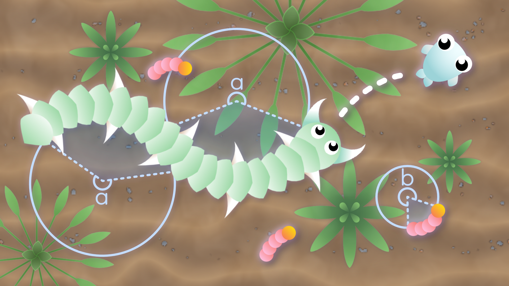
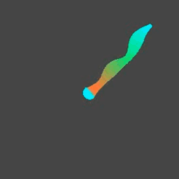
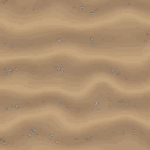
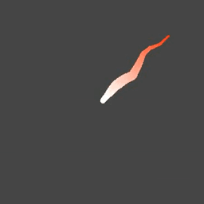
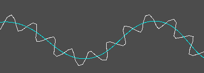

# Snake 2D for Godot
Snake 2D is a Godot Engine (v4.5.1) add-on for 2D snake-like movement.

Cool Wiggler | Leviathan | Restless Thing
--- | --- | ---
 |  | 

## Contents
This add-on adds two extra nodes to a Godot project:
* SnakeBody2D
* SnakeSprite2D

SnakeBody2D is for steering the snake and has all the snake movement logic.
SnakeSprite2D is just a sprite that "builds" the body of the snake.

A demo scene is included in this repository.
* scenes/snake_2d_demo.tscn

It is optional and not needed for the add-on to work.

## How to install
The add-on is located in the "addons/snake_2d" folder and works just like a standard add-on for Godot.
The downloadable zip-file can be found under "Releases" in the "About" section on GitHub.

#### New project
If you are starting from scratch or just want to try out the demo scene you can download the project, unzip it and import it in the Godot project manager.

#### Existing project
Download the project, unzip it and place the addons folder with its contents inside your Godot projects root directory.

## Usage
Follow the following steps to use the add-on:
1. Add a SnakeBody2D node to a scene. 
2. Add multiple SnakeSprite2D nodes as children to the SnakeBody2D node.
3. Add some textures to the sprites and run the scene to test it.

Play around with the exported values in SnakeBody2D to get the desired movement.

#### Steering
The SnakeBody2D node has a target_node property. Assign a node to it and the snake will follow the assigned node.
You can for example make a snake follow another snake. 
If no target_node is assigned, it will default to target the mouse position.

#### Trails
There is no pinning functionality in the SnakeBody2D but the properties used in the SnakeBody2D.arrive() function can be changed to work almost like a pin.
I found the following values to work ok:
* Assign a Target Node where the trail should attach.
* Arrive Distance = 5.
* Arrive Slowdown Distance = 10. Should always be higher than Arrive Distance.
* Arrive Slowdown Factor = 20.
* This can be a bit tricky but adjust Max Speed depending on how fast the body moves.

Then adjust the extra properties for damping and compression so that the trail shortens as the snake slows down.

#### Line2D
Want a Line2D instead of sprites? Add a Line2D node as child of SnakeBody2D.
With a Line2D you can adjust width along the body of the snake and even give it a gradient or a repeating texture.

You will still need SnakeSprite2D nodes but you can keep the texture properties empty.
It makes it easy to add nodes to specific parts of the snake, with just a Line2D you would need some code to place them where you want on the line.

## How it works
The SnakeBody2D saves positions in regular distances to itself. 
This creates a "center line" that starts at the head and ends by the tail of the snake.
A sinewave is sampled for each SnakeSprite2D.
The resulting position is rotated and becomes an offset from the center line, that is then applied to the SnakeSprite2D.
The sprites now follow the body in a wavy motion, like a snake. 

Lastly, effects were added like contraction and jitter to make the movement more interesting and fun.
